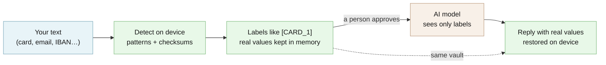

# @edgeproc/privacy-core

Lets apps hide card numbers, emails and similar IDs from AI, then restore them. Names and other details aren't caught.

[](https://github.com/hseshadr/privacy-core/actions/workflows/dagger.yml)
[](CHANGELOG.md)
[](LICENSE)

[Docs](docs/ARCHITECTURE.md) · [Quickstart](docs/QUICKSTART.md)

```text
you write:   Refund $482.10 to card 4242 4242 4242 4242 and email maria@example.com.
goes out:    Refund [AMOUNT_1] to card [CARD_1] and email [EMAIL_1].
model says:  I reviewed your statement. It referenced 3 redacted value(s): [AMOUNT_1], [CARD_1], [EMAIL_1].
you read:    I reviewed your statement. It referenced 3 redacted value(s): $482.10, 4242 4242 4242 4242, maria@example.com.
```
<sub>Real output of the example below, run against the published npm package 0.3.0 (the "model" is the built-in offline stand-in).</sub>

## At a glance

- **What it does** — Like the black marker on a redacted document, but reversible: before your app sends text to an AI model, it swaps card numbers, email addresses and other ID numbers for labels like `[CARD_1]`, and when the answer comes back it puts the real values back in, on the device. It finds a fixed, listed set of formats — [the full list](#what-it-recognizes-exactly) — using patterns and number checks, not AI.
- **Who it's for** — A developer adding an "ask the AI about this" button to a banking, billing or support app, who must not send customers' card or account numbers to an outside AI company.
- **What stays on your device / what leaves it** — Stays: every value it recognizes, and the table that maps each label back to it (held in memory, gone on reload). Leaves: only the text a person has approved — labels in place of the recognized values — sent to the AI service your app configures, and only when your code calls it. Names, addresses and anything else outside the list leave as written unless the person reviewing removes them. Your code cannot hand unapproved text to a provider: TypeScript rejects it at build time, and the library refuses it again at run time.
- **Runs on** — Any modern browser (tested in Chromium) or Node.js 22.13 and newer. One dependency; no server, no account, no download of models.
- **Not for** — Hiding names, places or free-text details (only three demo names are built in). Making text anonymous: the words around the labels can still point to a person.
- **Status** — Beta: v0.3.0 (pre-1.0), published on npm with build provenance. See [CHANGELOG](CHANGELOG.md).

## Try it in 60 seconds

Needs [Node](https://nodejs.org) 22.13 or newer. No API key, no account, no network call after the install.

```bash
mkdir try-privacy-core && cd try-privacy-core && npm init -y && npm install @edgeproc/privacy-core
```

Save this as `example.mjs` in that folder, then run `node example.mjs`:

```js
import { approve, guardedProvider, NoLLMProvider, redactForEgress, rehydrate, Vault } from "@edgeproc/privacy-core";

const text = "Refund $482.10 to card 4242 4242 4242 4242 and email maria@example.com.";
const vault = new Vault(); // the real values stay here, in memory, on this machine
const audit = () => {};    // plug in your own audit log

const pending = await redactForEgress(text, vault, audit); // 1. swap values for labels
const payload = approve(pending, audit);                  // 2. you approve what leaves
const reply = await guardedProvider(new NoLLMProvider()).complete(payload); // 3. offline stand-in model
const said = reply.redactedText.split("\n")[1];

console.log("you write:  ", text);
console.log("goes out:   ", payload.redactedText);
console.log("model says: ", said);
console.log("you read:   ", rehydrate(said, vault, payload.vaultRef)); // 4. restored locally
```

It prints, verbatim — the model only ever saw the labels; the real values came back on your machine:

```text
you write:   Refund $482.10 to card 4242 4242 4242 4242 and email maria@example.com.
goes out:    Refund [AMOUNT_1] to card [CARD_1] and email [EMAIL_1].
model says:  I reviewed your statement. It referenced 3 redacted value(s): [AMOUNT_1], [CARD_1], [EMAIL_1].
you read:    I reviewed your statement. It referenced 3 redacted value(s): $482.10, 4242 4242 4242 4242, maria@example.com.
```

Put a name in front — `Maria Lopez asked: refund $482.10 to card 4242 4242 4242 4242.` — and
what goes out is `Maria Lopez asked: refund [AMOUNT_1] to card [CARD_1].` The name is not caught.
That is why step 2 exists: a person reads the outgoing text before anything is sent.

More runnable examples: [`examples/`](examples/) (a browser demo) and
[the full loop, step by step](#the-full-loop-step-by-step).

<!-- ======================== BELOW THE FOLD ======================== -->

## How it works

Your text is scanned on the device by a fixed set of patterns and number checks (Luhn for cards,
mod-97 for IBANs). Each recognized value is written to an in-memory vault and replaced by a
typed label, which gives a *proposal*, not something a provider will accept. Only `approve()`
turns the proposal into a sendable payload, and provider adapters accept nothing else — a
plain string is a compile error, and a hand-built look-alike is refused at run time. When the
reply comes back, `rehydrate()` swaps the labels for the real values from the same vault.



**[Explore the interactive architecture map →](docs/architecture/index.html)**
(Archify, generated from [`docs/architecture/runtime.architecture.json`](docs/architecture/runtime.architecture.json)).
Deep dive: [docs/ARCHITECTURE.md](docs/ARCHITECTURE.md).

The source maps 1:1 to that picture:

```text
src/
├── index.ts            # public API barrel — the production surface, nothing else
├── types.ts            # shared domain types (EntityType, Span, AuditEntry, …)
├── egress.ts           # the boundary: branded RedactedPayload + LlmProvider + unsafeBypass
├── egressReceipt.ts    # signs allow/deny decisions into receipts when governed (hash only)
├── errors.ts           # typed fail-closed errors
├── redact.ts           # redactForEgress — the ONLY legitimate payload constructor
├── rehydrate.ts        # local restore of real values after the reply
├── vault.ts            # Vault — reversible token<->value map (in-memory)
├── detect/
│   ├── detector.ts     # detect() — merges patterns + dictionaries, unions overlaps
│   ├── patterns.ts     # the deterministic ruleset (generic + finance packs)
│   └── checksums.ts    # Luhn (cards), IBAN mod-97, SSA rules (bare SSNs)
├── providers/
│   ├── factory.ts      # makeProvider — picks OpenRouter or the offline echo
│   ├── nollm.ts        # NoLLMProvider — offline echo, runs with no API key
│   └── openrouter.ts   # OpenRouterProvider — OpenAI-compatible chat/completions
└── testing.ts          # SYNTHETIC_STATEMENT fixture — via the ./testing subpath,
                        #   NEVER from the main barrel
```

## What you can do

- Redact text on the device and review exactly what will be sent — [the full loop](#the-full-loop-step-by-step)
- Restore the real values into the model's reply, locally — [the full loop](#the-full-loop-step-by-step)
- Make "send raw text to the model" a build error, not a code-review comment — [compile error](#the-part-that-makes-leaking-a-compile-error)
- Get a signed record of every allowed and refused send — [receipts](#receipts-a-record-of-what-was-allowed-and-what-was-blocked)
- Call a real model through OpenRouter, or any OpenAI-compatible endpoint — [calling a real model](#calling-a-real-model)
- Watch the loop in a browser demo — [see it in a browser](#see-it-in-a-browser)

### What it recognizes, exactly

Detection is a fixed ruleset, so the honest version of "it finds the private
bits" is a list. This is the whole of it. If a format is not in the left column,
it is not detected, and the review step is what catches it.

| Type | Recognized | Not recognized |
| --- | --- | --- |
| `EMAIL` | any script, on both sides of the `@` — `ada@example.com`, `josé.álvarez@example.com`, `kontakt@münchen-bank.example` | a domain with no dot (`user@localhost`) |
| `SSN` | `123-45-6789`, `123 45 6789`, and the same shape with any **one** consistent separator — a dot (`123.45.6789`), any whitespace (NBSP included) or any Unicode dash (en/em dash, hyphen, minus) — with **any** digits, so ITINs (`912-70-1234`) and never-issued `666-…`/`000-…`/`…-00-…` values are redacted too; unseparated `123456789` only when it passes the SSA issuance rules (area not `000`/`666`/`9xx`, group not `00`, serial not `0000`) | an unseparated 9-digit run that could never have been issued — which is how routing numbers stay routing numbers; mixed separators (`123-45.6789`) |
| `PHONE` | US/NANP with `-`, `.` or space separators, optional parentheses, optional `+1`: `(415) 555-0132`, `+1(415) 555-0132`, `(415)`+tab/newline/NBSP+`555-0132`, `415-555-0132`, `212.555.0187`, `+1 646 555 0143` — also when glued to an extension (`415-555-0132x12` redacts the number). A parenthesized area code takes any digits; without parentheses, area and exchange must start `2`–`9` | an unformatted `4155550132`, a 7-digit local number, non-NANP international, an unparenthesized number whose area or exchange starts `0`/`1` (`123-456-7890`) |
| `CARD` | 13–19 digits with an optional space or hyphen between any two, **Luhn-valid** — every layout: `4111 1111 1111 1111`, `4111-1111-1111-1111`, unseparated, Amex `3782 822463 10005`, mixed separators, 8-8, 4-12, 6-13 and so on. The printed layouts (4-digit groups, Amex/Diners 4-6-5/4-6-4, unseparated) are also found after another digit group (`#2 4111 …`, a phone's last four) and before more digits (`4111 1111 1111 1111 12/27`, via a shorter retry) | runs that fail Luhn (deliberately — they are not card numbers); a card fused into a longer digit run with no separator; an irregular layout (8-8, 4-12, …) followed directly by more digits; other separators (dot, NBSP) |
| `IBAN` | grouped or compact, **mod-97-valid** — including when an uppercase word follows (`GB82 WEST … 32 ABCD`), by a mod-97 retry at the country's registered length (or any length for a country outside the ISO 13616 registry); groups may be separated by any whitespace | other bank identifiers (SWIFT/BIC, UK sort codes) |
| `ROUTING` | `Routing number: 021000021` — the English label is required | a bare routing number, which is not distinguishable from any other 9-digit run |
| `ACCOUNT` | `Account number: 000123456789` — 6 to 17 digits; the English label is required | a bare account number; a labelled one of 5 digits or fewer (indistinguishable from a year or amount elsewhere in the text) |
| `AMOUNT` | `$1,482.10` | other currencies |
| `DATE` | `01/14/2026` | every other date format |
| `NAME` | three demo names (`Ada Lovelace`, `Grace Hopper`, `Alan Turing`) | **every other name** — general name detection is not shipped |
| `MERCHANT` | five demo merchants (Whole Foods, Starbucks, Amazon, Walmart, Costco) | every other merchant |

The **Recognized** column is proved at the wire, not at the detector:
[`test/detector-completeness.test.ts`](test/detector-completeness.test.ts) drives
each format through the real send path and fails if the value — or an
identifying fragment of it — reaches the network. The limits that are easiest to
widen by accident (`4155550132`, phone-shaped reference numbers, 9-digit runs
that are not issuable SSNs) are pinned as tests too, so quietly broadening a rule
turns them red. The floor is pinned the other way as well:
[`test/v022-recall-floor.test.ts`](test/v022-recall-floor.test.ts) carries a
frozen copy of the v0.2.2 recognizers and fails if anything they redacted stops
being redacted, so a release cannot quietly narrow detection either.

## Why this and not X

You get a letter from a doctor, or a bank statement with a charge you don't
recognize, and you want an AI chatbot to explain it. So you paste the whole
thing in — your name, your phone number, your card number, all of it — because
that's the only way to get the answer.

This library is the other way around. It finds the private bits **on your own
device**, swaps each one for a label like `[CARD_1]`, and sends only the
labeled version to the model. When the answer comes back, it puts your real
values back in, locally. The model helps you. The model never sees what the detector catches.

"The private bits" means a specific, listed set of things — cards, emails,
phone numbers, SSNs, IBANs, amounts, dates. [What it recognizes,
exactly](#what-it-recognizes-exactly) is the full list, and the review step is
what covers everything outside it.

Three words used throughout, defined once:

- **redact** — replace a private value with a label.
- **rehydrate** — put the real value back when the answer returns.
- **egress** — anything leaving your device for the network.

| Alternative | It is the better choice when | This library is the better choice when |
| --- | --- | --- |
| Pasting the raw text into a chatbot | nothing sensitive is in it | it holds card, account or ID numbers — they reach the AI company as written |
| [Microsoft Presidio](https://github.com/microsoft/presidio) | you need names, places and many more types (it has NER models), and you run a Python service | the text must not leave the browser or phone at all; this library ports Presidio's patterns into the tab |
| [LLM Guard](https://github.com/protectai/llm-guard) `Anonymize` | you already run a Python gateway in front of your model | you want the check in the client, typed so a raw string cannot reach a provider |
| A hosted redaction API (cloud data-loss-prevention services) | you need broad detection and can send raw text to that vendor | sending raw text anywhere is the thing you are trying to avoid |
| Not using AI for this data | the risk is not worth it | you want the help and the listed identifiers kept back |

## Security and trust model

- **Verified:** every payload a provider receives was minted by `approve()`. TypeScript checks
  that at build time (a branded type), and `assertApproved()` checks it again at run time by
  object identity in a module-private registry. Optional receipts are Ed25519-signed with your
  key via [`@edgeproc/avow`](https://www.npmjs.com/package/@edgeproc/avow) and verifiable with
  your public key.
- **Refuses rather than warns:** an unapproved or hand-built payload (`UnapprovedPayloadError`,
  before any network call); input over 512 KiB (`InputTooLargeError`, before detection); input
  that already contains label-shaped text (`PlaceholderCollisionError`); a recognized value that
  would still appear in the output (`ResidualValueError`); rehydrating with the wrong vault
  (`VaultMismatchError`); a missing API key without an explicit offline opt-in
  (`MissingApiKeyError`); an OpenRouter reply that is late, too large or malformed.
  `unsafeBypass` exists, and always writes an audit entry.
- **Not protected:** anything outside [the recognized table](#what-it-recognizes-exactly)
  (names, places, free text); re-identification from context; a compromised device, browser
  extension, cross-site-scripting bug or dependency, which can read the in-memory vault and a
  browser-held signing key; and whatever the AI provider does with the labeled text. Details:
  [what this does not protect you from](#what-this-does-not-protect-you-from).
- **Verify a release:** 0.3.0 is published from CI with npm provenance (an SLSA build
  attestation linking the tarball to this repository's workflow). Check it with
  `npm view @edgeproc/privacy-core@0.3.0 dist.attestations` and, in a project that installed
  it, `npm audit signatures`.

See [SECURITY.md](SECURITY.md) for reporting a vulnerability.

## What this proves / what it does not prove

| Claim | Backed by |
| --- | --- |
| Only labels cross the network | `pnpm test:e2e` drives the browser demo in real Chromium, intercepts the outbound request, and fails if any real value is in it ([`e2e/`](e2e/)) |
| Every format in the recognized table is redacted at the wire | [`test/detector-completeness.test.ts`](test/detector-completeness.test.ts) |
| Nothing v0.2.2 redacted stops being redacted | [`test/v022-recall-floor.test.ts`](test/v022-recall-floor.test.ts) (a frozen copy of the v0.2.2 recognizers) |
| A raw string cannot reach a provider | [`test/brand-compile-proof.test.ts`](test/brand-compile-proof.test.ts) and `pnpm build` |
| Hostile input stays fast: 512 KiB of card-, IBAN- or email-shaped text in under 1.5 s (measured 100–250 ms on a CI-class Linux container, Node 22) | [`test/detection-regressions.test.ts`](test/detection-regressions.test.ts), timed outside coverage instrumentation |
| Every source line and branch is exercised | Vitest coverage thresholds pinned at 100% in `pnpm gate` |

It does **not** prove: that anything outside the recognized table is caught (it is not); that
the redacted text is anonymous; that a compromised device, browser extension or dependency
cannot read the in-memory vault; or anything about what the AI provider does with the labeled
text it receives.

## Install

```bash
npm install @edgeproc/privacy-core     # or: pnpm add / yarn add
```

Node.js 22.13+ or a modern browser bundler (ES modules only). Receipts need
`npm install @edgeproc/avow` alongside. From source: `git clone https://github.com/hseshadr/privacy-core && cd privacy-core && pnpm install && pnpm build`.

## Usage & API

### The full loop, step by step

You need [Node](https://nodejs.org) 22.13 or newer. Nothing else — no API key, no account, no
network call. Save this as `example.mjs` in any empty directory (it prints each step, including the audit log):

```js
import {
  approve, guardedProvider, NoLLMProvider, redactForEgress, rehydrate, Vault,
} from "@edgeproc/privacy-core";

const statement =
  "Grace Hopper, card 4242 4242 4242 4242, was charged $482.10 at Whole Foods on 01/14/2026.";

const vault = new Vault(); // holds your real values, in this process, on this machine
const audit = (e) => console.log("[audit]", e.kind, e.placeholders);

// 1. REDACT on-device. This is a proposal — no provider will accept it yet.
const pending = await redactForEgress(statement, vault, audit);
console.log("leaves your machine:", pending.redactedText);

// 2. APPROVE. You read the line above and say yes; only this mints a sendable payload.
const payload = approve(pending, audit);

// 3. SEND. NoLLMProvider is the built-in offline stand-in — no API key, no network.
const reply = await guardedProvider(new NoLLMProvider()).complete(payload);
console.log("model replied:", reply.redactedText);

// 4. REHYDRATE locally, bound to the vault the text was redacted with.
console.log("you read:", rehydrate(reply.redactedText, vault, payload.vaultRef));
```

Then:

```bash
npm install @edgeproc/privacy-core && node example.mjs
```

That prints, verbatim:

```text
[audit] redact [ '[NAME_1]', '[CARD_1]', '[AMOUNT_1]', '[MERCHANT_1]', '[DATE_1]' ]
leaves your machine: [NAME_1], card [CARD_1], was charged [AMOUNT_1] at [MERCHANT_1] on [DATE_1].
[audit] approve [ '[NAME_1]', '[CARD_1]', '[AMOUNT_1]', '[MERCHANT_1]', '[DATE_1]' ]
model replied: Summary (offline echo — no API key set):
I reviewed your statement. It referenced 5 redacted value(s): [NAME_1], [CARD_1], [AMOUNT_1], [MERCHANT_1], [DATE_1].
The first flagged value, [NAME_1], is the one to check.
(Set OPENROUTER_API_KEY + VITE_USE_OPENROUTER=1 to call a real model via the dev proxy.)
you read: Summary (offline echo — no API key set):
I reviewed your statement. It referenced 5 redacted value(s): Grace Hopper, 4242 4242 4242 4242, $482.10, Whole Foods, 01/14/2026.
The first flagged value, Grace Hopper, is the one to check.
(Set OPENROUTER_API_KEY + VITE_USE_OPENROUTER=1 to call a real model via the dev proxy.)
```

Step 2 is the one people skip. `redactForEgress` returns a *proposal*, not something you can send.
Nothing becomes sendable until `approve()` — and that holds even when the detector finds nothing,
because "found nothing" is not the same as "someone said yes". Provider adapters accept only the
type `approve()` mints, so passing one a raw string is
[a compile error](#the-part-that-makes-leaking-a-compile-error), not a code-review comment.

To swap the offline stand-in for a real model, see
[Calling a real model](#calling-a-real-model). For a signed record of every allow and deny, see
[Receipts](#receipts-a-record-of-what-was-allowed-and-what-was-blocked).

### The part that makes leaking a compile error

The rule "don't send raw text to the model" isn't a convention here, and it isn't
a runtime check you could forget to call. Provider adapters accept **only** a
branded `RedactedPayload` type, and the only thing that mints one is the
redaction pipeline (`redactForEgress` → `approve`). A plain `string` is not
assignable to it, so this:

```ts
import { NoLLMProvider } from "@edgeproc/privacy-core";

const provider = new NoLLMProvider();
await provider.complete("my card is 4242 4242 4242 4242");
```

fails before it ever runs:

```text
oops.ts(4,25): error TS2345: Argument of type 'string' is not assignable to parameter of type 'RedactedPayload'.
  Type 'string' is not assignable to type 'Branded<"RedactedPayload">'.
```

TypeScript's brand disappears at runtime, so the same guarantee is enforced a
second way: every approved payload is registered by object identity, and
`assertApproved()` rejects a hand-built or spread-cloned look-alike before any
network call — that's the `UnapprovedPayloadError` in the receipts example
above. `pnpm build` re-proves the compile-time half on every build.

### Receipts: a record of what was allowed and what was blocked

Receipts are **opt-in**. Hand `guardedProvider` a governance context — a
provider name, your signing key, and an `onReceipt` callback — and from then on
every decision it makes is signed into a **receipt**: a small record saying
"text with this fingerprint was allowed (or refused) to go to this provider",
signed with your key. Refusals are recorded too, so a blocked send can't just
vanish. A receipt never contains the text itself, only a SHA-256 hash of it.

Omit that argument and you get exactly the same redaction and the same
fail-closed guard — just no receipt. Turn receipts on when you need to prove
afterwards what left the device; leave them off when you don't.

Receipts are tamper-evident records, not replay-prevention tokens. The signed
Avow envelope is deterministic, so two identical decisions produce identical
receipts; a downstream audit store must track receipt occurrences if it needs
to count sends rather than only verify their content.

Signing and verifying live in `@edgeproc/avow`, so add it alongside:
`npm install @edgeproc/avow`.

```js
import { generateSeedHex, publicKeyHex, verifySignature } from "@edgeproc/avow";
import {
  approve,
  guardedProvider,
  NoLLMProvider,
  redactForEgress,
  Vault,
} from "@edgeproc/privacy-core";

const seedHex = generateSeedHex(); // your signing key, generated on this device
const receipts = [];

const provider = guardedProvider(new NoLLMProvider(), {
  provider: "offline-echo",
  seedHex,
  onReceipt: (r) => receipts.push(r),
});

const vault = new Vault();
const pending = await redactForEgress("Card on file: 4242 4242 4242 4242", vault);
await provider.complete(approve(pending, () => {}));

// A payload the guard never approved is refused — and the refusal is recorded too.
// (In TypeScript this call wouldn't even compile; plain JS shows the runtime half.)
await provider
  .complete({ redactedText: "raw card 4242 4242 4242 4242", vaultRef: { id: "x" } })
  .catch((err) => console.log("refused:", err.constructor.name));

for (const r of receipts) console.log(r.payload);

// Anyone holding your public key can check the receipts were not edited later.
await verifySignature(receipts[0], await publicKeyHex(seedHex));
console.log("\nsignature check: passed");
```

```text
refused: UnapprovedPayloadError
{
  action: 'llm.egress',
  provider: 'offline-echo',
  args_digest: 'sha256:091a3728dd5622843e14ffb925abcec1bd1cb5ad6461154ab0893b68f63d50b1',
  decision: 'allow',
  detector_version: '2'
}
{
  action: 'llm.egress',
  provider: 'offline-echo',
  args_digest: 'sha256:6726c6222d515ab998abb62680724ca993157f40a9021ab0643d0e967f4b417b',
  decision: 'deny',
  detector_version: '2'
}

signature check: passed
```

**What a receipt is worth, precisely.** A signature proves a record has not been
altered *since it was signed*. It says nothing about whether the machine that
signed it was already compromised at the time. If an attacker controls the host,
they can make it sign a true-looking record of a decision you never wanted.
Receipts give you tamper-evidence after the fact, not a trustworthy host.

### Calling a real model

The library is environment-agnostic: you pass your own key in, and it is never
read from the environment for you. The bundled demo keeps `OPENROUTER_API_KEY`
server-side — a same-origin dev proxy injects it, so it never reaches the browser
bundle. Copy `.env.example` → `examples/demo/.env`, set the key, add
`VITE_USE_OPENROUTER=1`, and re-run `pnpm demo`.

### See it in a browser

Clone this repo and run the demo, which does the same loop with a live preview
of exactly what will be sent:

```bash
pnpm install && pnpm demo   # then open http://localhost:5173
```


Open your browser's network tab and watch the request. Only labels go out.
Nothing is sent until you click **Approve & send** — you approve the exact
outgoing text, not a promise about it.

To prove it without a browser window, `pnpm test:e2e` drives the same loop in
real Chromium, intercepts the outbound request, and fails if any real value
appears in it.

### Public API

Everything `src/index.ts` exports, and nothing more:

| Export | Kind | Role |
|---|---|---|
| `detect` | fn | deterministic identifier span detection |
| `approve` | fn | explicit review step → mints the sendable payload (audit sink required) |
| `assertApproved` | fn | runtime half of the guard — rejects unminted payloads |
| `guardedProvider` | fn | wrap a provider so the runtime guard runs at one chokepoint — plus receipts if given a governance context |
| `LlmProvider` | interface | provider contract — accepts only `RedactedPayload` |
| `PendingRedaction` | type | a redaction proposal awaiting explicit review — not yet sendable |
| `RedactedPayload` | type | the branded egress type |
| `unsafeBypass` | fn | the explicit, audited escape hatch |
| `buildEgressSubject` | fn | build the signed subject (hash of redacted text, decision, provider) |
| `contentHash` | fn | the canonical hash a verifier recomputes `args_digest` with |
| `DETECTOR_VERSION` | const | version tag for the detector ruleset, recorded in each receipt |
| `EgressDecision` | type | the guard's verdict on one egress attempt — allow or deny |
| `EgressGovernance` | interface | how a guarded provider seals its decisions (signer seed + receipt sink) |
| `EgressSubject` | type | the signed, hash-only record of one egress decision |
| `EgressSubjectInput` | interface | what the caller supplies to build an `EgressSubject` |
| `sealEgressReceipt` | fn | sign one egress decision into a receipt |
| `makeProvider` | fn | config-driven provider selector |
| `ProviderConfig` | interface | host-supplied config (API key, model, endpoint, timeout and response budget) for `makeProvider` |
| `SelectedProvider` | interface | the provider `makeProvider` picked, plus a label for the UI |
| `NoLLMProvider` | class | offline echo provider |
| `OpenRouterConfig` | interface | config for `OpenRouterProvider` (API key, model, endpoint, timeout and response budget) |
| `OpenRouterProvider` | class | OpenAI-compatible provider |
| `DEFAULT_OPENROUTER_TIMEOUT_MS` | const | default OpenRouter deadline (30 seconds) |
| `DEFAULT_OPENROUTER_MAX_RESPONSE_BYTES` | const | default OpenRouter response cap (1 MiB UTF-8) |
| `MAX_REDACTION_INPUT_BYTES` | const | UTF-8 input budget enforced before detection (512 KiB) |
| `redactForEgress` | fn | detect → vault-write → brand → a `PendingRedaction` proposal |
| `rehydrate` | fn | restore real values locally from placeholders |
| `AuditEntry` | type | one append-only audit record — a discriminated union of the three below |
| `RedactAuditEntry` | interface | audit record for a redact step |
| `ApproveAuditEntry` | interface | audit record for an approve step |
| `UnsafeBypassAuditEntry` | interface | audit record for an explicit unsafe-bypass |
| `AuditSink` | type | the audit callback signature callers supply to `approve`/`unsafeBypass` |
| `EntityType` | type | the identifier categories the detector recognizes (CARD, SSN, EMAIL, ...) |
| `RedactedResponse` | interface | a provider's reply, still in placeholder form until rehydrated |
| `Span` | interface | one detected identifier span (type, value, start, end) |
| `VaultRef` | interface | opaque handle to a vault's token → value mappings |
| `Vault` | class | reversible token↔value map |

Typed fail-closed errors are exported too, all extending the `PrivacyCoreError`
base class: `ForgedPayloadError`, `InputTooLargeError`, `MalformedProviderResponseError`,
`MissingApiKeyError`, `PlaceholderCollisionError`, `ProviderResponseTooLargeError`,
`ProviderTimeoutError`, `ResidualValueError`, `UnapprovedPayloadError`,
`UnresolvedPlaceholderError`, `VaultMismatchError`.

The brand factory (`mintPendingRedaction`) and the `SYNTHETIC_STATEMENT` fixture
are intentionally **not** on the front door — a payload can be earned, not
forged, and a fixture is never shipped by accident.

## Configuration

The library reads no environment variables; your code passes every setting in.

| Setting | Where | Default | What it changes |
| --- | --- | --- | --- |
| `apiKey` | `OpenRouterConfig` / `ProviderConfig` | — (required for OpenRouter) | the key sent to OpenRouter; keep it server-side (the demo uses a same-origin proxy) |
| `model` | `OpenRouterConfig` / `ProviderConfig` | `openai/gpt-4o-mini` via `makeProvider` | which model answers |
| `endpoint` | `OpenRouterConfig` / `ProviderConfig` | `https://openrouter.ai/api/v1/chat/completions` | any OpenAI-compatible chat/completions URL |
| `timeoutMs` | `OpenRouterConfig` / `ProviderConfig` | `30000` | end-to-end request deadline |
| `maxResponseBytes` | `OpenRouterConfig` / `ProviderConfig` | `1048576` (1 MiB) | largest reply accepted |
| `allowOffline` | `ProviderConfig` | `false` | lets `makeProvider` fall back to the offline echo when no key is set |
| `MAX_REDACTION_INPUT_BYTES` | constant | 512 KiB | input budget; larger input is refused |

The demo app reads `OPENROUTER_API_KEY` and `VITE_USE_OPENROUTER=1` from `examples/demo/.env`
(copy `.env.example`). Secrets are never committed.

## Limitations & roadmap

### What this does not protect you from

Read this before you trust it with anything that matters. Over-claiming privacy
is worse than claiming none.

- **It only hides what it recognizes**, and that set is exactly the table above —
  patterns plus checksums plus two small dictionaries. It will miss an oddly
  formatted account number, an unusual name, a kind of private data nobody wrote
  a rule for. The built-in name list is three demo names; general name detection
  is not shipped. **That is why you review the outgoing text before it goes.** A
  human catching a miss is the actual guarantee; the tool's job is to make the
  text you're about to send visible and approvable, not to promise it caught
  everything.

- **Redaction input is bounded.** `redactForEgress` accepts at most 512 KiB of
  UTF-8 text (`MAX_REDACTION_INPUT_BYTES`). Larger input fails closed with
  `InputTooLargeError` before detection, vault writes, or audit callbacks. Split
  a large document into reviewed sections rather than raising this limit in an
  untrusted browser path.

- **Hiding names is not the same as being anonymous.** Even with every name and
  number stripped, the shape of the text can identify you: "$482.10, the word
  *insurance*, early January" can point at one person with no identifier left in
  it. This reduces direct leakage of identifiers. It does not make data
  anonymous, and it will not stop someone deliberately trying to re-identify you.

- **The vault is in memory and clears on reload.** Your real values are held in
  ordinary process/tab memory for the length of the session, by design in this
  version. An encrypted stored vault is on the roadmap, not shipped.

- **Browser key custody is same-origin, not hardware-backed.** Signing keys held
  in a browser are protected by the browser's same-origin rules and nothing
  stronger. Anything that can run code on your origin — a malicious extension, a
  cross-site scripting bug, a compromised dependency — can reach them. There is
  no secure element or OS keychain involved.

- **The OpenRouter adapter has bounded network resources.** Each request has a
  30-second end-to-end deadline and accepts at most a 1 MiB UTF-8 response by
  default. Override `timeoutMs` or `maxResponseBytes` in `OpenRouterConfig` only
  when your host has a deliberate, tested budget; timeout and overflow failures
  are typed and fail closed.

If any of those limits are unacceptable for what you're doing, this is the wrong
tool. Say so out loud rather than working around it.

### Shipped and planned

**Shipped (v0.3.0):** on-device detection of the formats in
[the recognized table](#what-it-recognizes-exactly); reversible labels and local restore; the
approve step; the build-time and run-time egress guard; opt-in signed receipts; the offline
stand-in and OpenRouter providers; an in-memory vault.

**Planned (not shipped):**

- An encrypted stored vault (AES-GCM + passphrase KDF over IndexedDB). Today's vault is
  in-memory and clears on reload.
- Contextual name/place detection to widen recall past the fixed ruleset, as an optional,
  off-by-default adapter.
- Durable audit and receipt storage — the sinks are wired today; persistence is not.
- More domain rule packs (medical, legal, HR, identity), and generalization modes (amount
  bucketing, date coarsening) that would start to address the anonymity limit.

## Getting help

- **GitHub Issues** — Best for: bugs and concrete feature requests.
- **Email (private)** — Best for: security reports; see [SECURITY.md](SECURITY.md).

## Contributing / development

```bash
pnpm gate   # lint → typecheck → unit tests (100% coverage) → browser e2e → build
```

`pnpm gate` is exactly what CI runs. See [docs/QUICKSTART.md](docs/QUICKSTART.md) and
[CONTRIBUTING.md](CONTRIBUTING.md).

## License / Citation

MIT. Recognizer patterns are ported from Microsoft Presidio (MIT); the
redact/rehydrate vault design follows LLM Guard's `Anonymize`/`Vault` (MIT),
reimplemented here in TypeScript.
