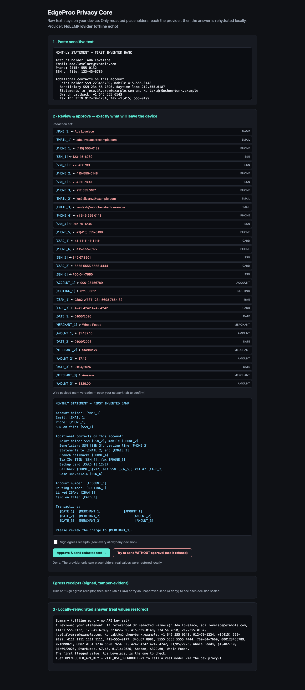

# @edgeproc/privacy-core

A TypeScript library that hides card numbers, emails and ID numbers from AI models, then puts them back in the reply.

**`npm install @edgeproc/privacy-core`**. Works in Node 22.13+ and in the browser (tested in Chromium). No account, no API key needed to try it.

[](https://github.com/hseshadr/privacy-core/actions/workflows/dagger.yml)
[](https://www.npmjs.com/package/@edgeproc/privacy-core)
[](LICENSE)

Say you build a banking, billing or support app and want an "ask the AI about this"
button. The text your users paste in is full of card numbers, account numbers and
email addresses. If you send it as is, all of that ends up with the AI company. Most
teams either skip the feature or hope nobody pastes anything sensitive.

This library sits in your app, before the call to the AI. It finds those values on
the user's device, swaps each one for a label like `[CARD_1]`, and shows the person
exactly what will be sent. After they approve, only the labeled text goes out. When
the answer comes back, the real values are put back in, on the device. Your code
cannot skip the approval step by accident: TypeScript refuses to compile it.

**Technical docs:** [Architecture](docs/ARCHITECTURE.md) · [What it recognizes](docs/DETECTION.md) · [Using the library (API)](docs/API.md) · [Getting started for developers](docs/GETTING_STARTED.md)

## Try it

You need Node 22.13 or newer. No API key and no network call after the install. This
was run against the published npm package, version 0.3.0.

1. Make an empty project and install the package:

   ```bash
   mkdir try-privacy-core && cd try-privacy-core && npm init -y && npm install @edgeproc/privacy-core
   ```

2. Save this as `example.mjs`:

   ```js
   import { approve, guardedProvider, NoLLMProvider, redactForEgress, rehydrate, Vault } from "@edgeproc/privacy-core";

   const text = "Maria Lopez asked: refund $482.10 to card 4242 4242 4242 4242 and email maria@example.com.";
   const vault = new Vault(); // keeps the real values, in memory, on this machine
   const log = (entry) => console.log("[log]", entry.kind, entry.placeholders.join(" "));

   const pending = await redactForEgress(text, vault, log); // 1. swap values for labels
   console.log("will send: ", pending.redactedText);

   const payload = approve(pending, log); // 2. a person has read the line above and said yes
   const reply = await guardedProvider(new NoLLMProvider()).complete(payload); // 3. offline stand-in model
   const answer = reply.redactedText.split("\n")[1];

   console.log("AI saw:    ", answer);
   console.log("you see:   ", rehydrate(answer, vault, payload.vaultRef)); // 4. real values put back locally
   ```

3. Run `node example.mjs`. This is the real output:

   ```text
   [log] redact [AMOUNT_1] [CARD_1] [EMAIL_1]
   will send:  Maria Lopez asked: refund [AMOUNT_1] to card [CARD_1] and email [EMAIL_1].
   [log] approve [AMOUNT_1] [CARD_1] [EMAIL_1]
   AI saw:     I reviewed your statement. It referenced 3 redacted value(s): [AMOUNT_1], [CARD_1], [EMAIL_1].
   you see:    I reviewed your statement. It referenced 3 redacted value(s): $482.10, 4242 4242 4242 4242, maria@example.com.
   ```

The amount, card and email were replaced. The name is not caught: "Maria Lopez" goes
out as written. That is why step 2 exists. A person reads the outgoing text before
anything is sent, and removes what the library missed.

`NoLLMProvider` is a built-in stand-in that just echoes the labels back, so the example
runs offline. To call a real model, swap in `OpenRouterProvider` (any OpenAI-compatible
endpoint). See [Using the library](docs/API.md#calling-a-real-model).

There is also a browser demo in this repo. Clone it and run `pnpm install && pnpm demo`,
then open http://localhost:5173. It loads a made-up bank statement, shows each value
next to its label, shows the exact text that will be sent, and puts the real values
back in the answer after you click **Approve & send**:



## How it works

The library scans the text on the device with a fixed set of patterns and number
checks (for example the Luhn check digit on card numbers). It does not use AI to find
values. Each value it finds goes into a `Vault`, an in-memory table, and is replaced
by a label. The result is only a proposal. Your code must call `approve()` to turn it
into something a provider will accept, and the provider classes accept nothing else:
passing a plain string is a TypeScript error, and a hand-made copy is refused when the
code runs. When the reply arrives, `rehydrate()` swaps the labels back using the same
vault.

## What it does not do

- **It does not find names, addresses or free text.** It finds cards, emails, US phone
  numbers, SSNs, IBANs, labeled account and routing numbers, dollar amounts, US dates,
  and a few demo names and merchants. That is the whole list. See
  [What it recognizes](docs/DETECTION.md) for the exact formats.
- **It does not make text anonymous.** The words around the labels can still point to
  a person ("$482.10, insurance, early January").
- **It does not store anything.** The vault lives in memory and is gone on reload. An
  encrypted stored vault is planned, not shipped.
- **It does not protect a compromised device.** A malicious browser extension, a
  cross-site scripting bug or a bad dependency can read the vault in memory.
- **It does not control what the AI company does** with the labeled text it receives.
- **Input is capped at 512 KiB** per call. Split larger documents.

## When to use something else

| If you need | Use |
| --- | --- |
| Names, places and many more types, and you can run a Python service | [Microsoft Presidio](https://github.com/microsoft/presidio) |
| A check in a Python gateway you already run in front of the model | [LLM Guard](https://github.com/protectai/llm-guard) `Anonymize` |
| Broad detection, and you are fine sending raw text to a vendor | A hosted data-loss-prevention API |
| Card, account and ID numbers kept on the user's device, with a review step your code cannot skip | This library |

## Install

```bash
npm install @edgeproc/privacy-core     # or: pnpm add / yarn add
```

ES modules only. Node 22.13+ or a modern browser bundler. One dependency,
[`@edgeproc/avow`](https://www.npmjs.com/package/@edgeproc/avow), which signs the
optional receipts (a signed record of every allowed or refused send; see
[the API docs](docs/API.md#receipts-a-record-of-what-was-allowed-and-what-was-blocked)).

## Develop

You need Node 24 (what CI uses) and pnpm via `corepack`.

```bash
git clone https://github.com/hseshadr/privacy-core && cd privacy-core
corepack enable && pnpm install
pnpm exec playwright install chromium   # first time only, for the browser tests
pnpm gate
```

`pnpm gate` runs the same checks as CI: lint, type checks, unit tests with 100%
coverage, the browser test that checks only labels leave the page, and the build.
It takes about 30 seconds. New here? Read
[Getting started for developers](docs/GETTING_STARTED.md).

## More detail

- [Getting started for developers](docs/GETTING_STARTED.md): set up, run the checks, make your first change.
- [Architecture](docs/ARCHITECTURE.md): how the parts fit, the security model, what the tests prove, limits and roadmap.
- [Explore the interactive architecture map](docs/architecture/index.html).
- [What it recognizes](docs/DETECTION.md): every format it finds, and the ones it does not.
- [Using the library](docs/API.md): the full example, the compile-time check, signed receipts, every export and setting.
- [Quickstart](docs/QUICKSTART.md): the browser demo and calling a real model.
- [Contributing](CONTRIBUTING.md), [Security policy](SECURITY.md) and [Changelog](CHANGELOG.md).

## License

MIT. See [LICENSE](LICENSE). Recognizer patterns are ported from Microsoft Presidio
(MIT). The vault design follows LLM Guard's `Anonymize`/`Vault` (MIT).
