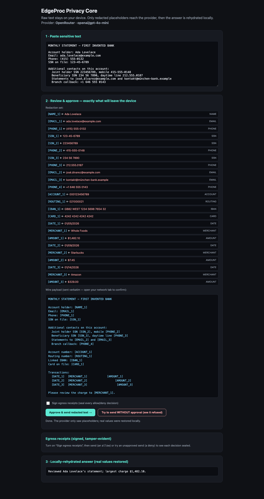

# @edgeproc/privacy-core

You get a letter from a doctor, or a bank statement with a charge you don't
recognize, and you want an AI chatbot to explain it. So you paste the whole
thing in — your name, your phone number, your card number, all of it — because
that's the only way to get the answer.

This library is the other way around. It finds the private bits **on your own
device**, swaps each one for a label like `[CARD_1]`, and sends only the
labeled version to the model. When the answer comes back, it puts your real
values back in, locally. The model helps you. The model never sees you.

Here is the whole idea. Say you paste this:

```text
I want to dispute a charge on my card.
Account holder: Grace Hopper
Email: grace.hopper@example.com
Phone: (415) 555-0132
Card on file: 4242 4242 4242 4242
On 01/14/2026 I was charged $482.10 at Whole Foods and I was never there.
```

This is what actually leaves your device:

```text
I want to dispute a charge on my card.
Account holder: [NAME_1]
Email: [EMAIL_1]
Phone: [PHONE_1]
Card on file: [CARD_1]
On [DATE_1] I was charged [AMOUNT_1] at [MERCHANT_1] and I was never there.
```

The model writes its reply about `[NAME_1]` and `[CARD_1]`. Before you read it,
the library swaps the real values back in — on your machine, from a table the
model was never shown. You see a normal answer about Grace Hopper's card.

Three words you'll see below, defined once:

- **redact** — replace a private value with a label.
- **rehydrate** — put the real value back when the answer returns.
- **egress** — anything leaving your device for the network.

## Run it yourself in one minute

You need [Node](https://nodejs.org) 22.13 or newer. No API key, no account —
the loop runs against a built-in offline stand-in model.

```bash
mkdir privacy-try && cd privacy-try
npm init -y && npm pkg set type=module
npm install @edgeproc/privacy-core
```

Save this as `try-it.mjs`:

```js
import {
  approve,
  makeProvider,
  redactForEgress,
  rehydrate,
  Vault,
} from "@edgeproc/privacy-core";

// The thing you'd normally paste straight into a chatbot.
const statement = `I want to dispute a charge on my card.
Account holder: Grace Hopper
Email: grace.hopper@example.com
Phone: (415) 555-0132
Card on file: 4242 4242 4242 4242
On 01/14/2026 I was charged $482.10 at Whole Foods and I was never there.`;

// The vault holds your real values. It lives in this process, on this machine.
const vault = new Vault();

// 1. REDACT — swap every detected value for a label.
const pending = await redactForEgress(statement, vault);
console.log("--- what would leave your device ---");
console.log(pending.redactedText);

// 2. APPROVE — you read the above and say yes. Nothing is sendable until you do.
const payload = approve(pending, (entry) => console.log("\n[audit]", entry.kind));

// 3. SEND — with no API key, this uses a built-in offline stand-in model.
const { provider, label } = makeProvider();
const reply = await provider.complete(payload);
console.log(`\n--- reply from ${label} — it only ever saw the text above ---`);
console.log(reply.redactedText);

// 4. REHYDRATE — put your real values back, locally.
console.log("\n--- what you actually read ---");
console.log(rehydrate(reply.redactedText, vault, payload.vaultRef));
```

Then `node try-it.mjs`. You get:

```text
--- what would leave your device ---
I want to dispute a charge on my card.
Account holder: [NAME_1]
Email: [EMAIL_1]
Phone: [PHONE_1]
Card on file: [CARD_1]
On [DATE_1] I was charged [AMOUNT_1] at [MERCHANT_1] and I was never there.

[audit] approve

--- reply from NoLLMProvider (offline echo) — it only ever saw the text above ---
Summary (offline echo — no API key set):
I reviewed your statement. It referenced 7 redacted value(s): [NAME_1], [EMAIL_1], [PHONE_1], [CARD_1], [DATE_1], [AMOUNT_1], [MERCHANT_1].
The first flagged value, [NAME_1], is the one to check.
(Set OPENROUTER_API_KEY + VITE_USE_OPENROUTER=1 to call a real model via the dev proxy.)

--- what you actually read ---
Summary (offline echo — no API key set):
I reviewed your statement. It referenced 7 redacted value(s): Grace Hopper, grace.hopper@example.com, (415) 555-0132, 4242 4242 4242 4242, 01/14/2026, $482.10, Whole Foods.
The first flagged value, Grace Hopper, is the one to check.
(Set OPENROUTER_API_KEY + VITE_USE_OPENROUTER=1 to call a real model via the dev proxy.)
```

The last two blocks are the point: the model's reply mentions `[NAME_1]`, and
what you read says *Grace Hopper*. That substitution happened on your machine,
after the network call was over.

## See it in a browser

Clone this repo and run the demo, which does the same loop with a live preview
of exactly what will be sent:

```bash
pnpm install && pnpm demo   # then open http://localhost:5173
```



Open your browser's network tab and watch the request. Only labels go out.
Nothing is sent until you click **Approve & send** — you approve the exact
outgoing text, not a promise about it.

To prove it without a browser window, `pnpm test:e2e` drives the same loop in
real Chromium, intercepts the outbound request, and fails if any real value
appears in it.

## What this does not protect you from

Read this before you trust it with anything that matters. Over-claiming privacy
is worse than claiming none.

- **It only hides what it recognizes.** Detection is a fixed ruleset — patterns
  plus checksums (card numbers are Luhn-checked, IBANs mod-97-checked) plus small
  dictionaries. It will miss an oddly formatted account number, an unusual name,
  a kind of private data nobody wrote a rule for. The built-in name list is three
  demo names; general name detection is not shipped. **That is why you review the
  outgoing text before it goes.** A human catching a miss is the actual
  guarantee; the tool's job is to make the text you're about to send visible and
  approvable, not to promise it caught everything.

- **Hiding names is not the same as being anonymous.** Even with every name and
  number stripped, the shape of the text can identify you: "$482.10, the word
  *insurance*, early January" can point at one person with no identifier left in
  it. This reduces direct leakage of identifiers. It does not make data
  anonymous, and it will not stop someone deliberately trying to re-identify you.

- **The vault is in memory and clears on reload.** Your real values are held in
  ordinary process/tab memory for the length of the session, by design in this
  version. An encrypted stored vault is on the roadmap, not shipped.

- **Browser key custody is same-origin, not hardware-backed.** Signing keys held
  in a browser are protected by the browser's same-origin rules and nothing
  stronger. Anything that can run code on your origin — a malicious extension, a
  cross-site scripting bug, a compromised dependency — can reach them. There is
  no secure element or OS keychain involved.

If any of those limits are unacceptable for what you're doing, this is the wrong
tool. Say so out loud rather than working around it.

## Receipts: a record of what was allowed and what was blocked

Receipts are **opt-in**. Hand `guardedProvider` a governance context — a
provider name, your signing key, and an `onReceipt` callback — and from then on
every decision it makes is signed into a **receipt**: a small record saying
"text with this fingerprint was allowed (or refused) to go to this provider",
signed with your key. Refusals are recorded too, so a blocked send can't just
vanish. A receipt never contains the text itself, only a SHA-256 hash of it.

Omit that argument and you get exactly the same redaction and the same
fail-closed guard — just no receipt. Turn receipts on when you need to prove
afterwards what left the device; leave them off when you don't.

Signing and verifying live in `@edgeproc/avow`, so add it alongside:
`npm install @edgeproc/avow`.

```js
import { generateSeedHex, publicKeyHex, verifySignature } from "@edgeproc/avow";
import {
  approve,
  guardedProvider,
  NoLLMProvider,
  redactForEgress,
  Vault,
} from "@edgeproc/privacy-core";

const seedHex = generateSeedHex(); // your signing key, generated on this device
const receipts = [];

const provider = guardedProvider(new NoLLMProvider(), {
  provider: "offline-echo",
  seedHex,
  onReceipt: (r) => receipts.push(r),
});

const vault = new Vault();
const pending = await redactForEgress("Card on file: 4242 4242 4242 4242", vault);
await provider.complete(approve(pending, () => {}));

// A payload the guard never approved is refused — and the refusal is recorded too.
// (In TypeScript this call wouldn't even compile; plain JS shows the runtime half.)
await provider
  .complete({ redactedText: "raw card 4242 4242 4242 4242", vaultRef: { id: "x" } })
  .catch((err) => console.log("refused:", err.constructor.name));

for (const r of receipts) console.log(r.payload);

// Anyone holding your public key can check the receipts were not edited later.
await verifySignature(receipts[0], await publicKeyHex(seedHex));
console.log("\nsignature check: passed");
```

```text
refused: UnapprovedPayloadError
{
  action: 'llm.egress',
  provider: 'offline-echo',
  args_digest: 'sha256:091a3728dd5622843e14ffb925abcec1bd1cb5ad6461154ab0893b68f63d50b1',
  decision: 'allow',
  detector_version: '1'
}
{
  action: 'llm.egress',
  provider: 'offline-echo',
  args_digest: 'sha256:6726c6222d515ab998abb62680724ca993157f40a9021ab0643d0e967f4b417b',
  decision: 'deny',
  detector_version: '1'
}

signature check: passed
```

**What a receipt is worth, precisely.** A signature proves a record has not been
altered *since it was signed*. It says nothing about whether the machine that
signed it was already compromised at the time. If an attacker controls the host,
they can make it sign a true-looking record of a decision you never wanted.
Receipts give you tamper-evidence after the fact, not a trustworthy host.

---

# For developers

## The part that makes leaking a compile error

The rule "don't send raw text to the model" isn't a convention here, and it isn't
a runtime check you could forget to call. Provider adapters accept **only** a
branded `RedactedPayload` type, and the only thing that mints one is the
redaction pipeline (`redactForEgress` → `approve`). A plain `string` is not
assignable to it, so this:

```ts
import { NoLLMProvider } from "@edgeproc/privacy-core";

const provider = new NoLLMProvider();
await provider.complete("my card is 4242 4242 4242 4242");
```

fails before it ever runs:

```text
oops.ts(4,25): error TS2345: Argument of type 'string' is not assignable to parameter of type 'RedactedPayload'.
  Type 'string' is not assignable to type 'Branded<"RedactedPayload">'.
```

TypeScript's brand disappears at runtime, so the same guarantee is enforced a
second way: every approved payload is registered by object identity, and
`assertApproved()` rejects a hand-built or spread-cloned look-alike before any
network call — that's the `UnapprovedPayloadError` in the receipts example
above. `pnpm build` re-proves the compile-time half on every build.

## Architecture — maps 1:1 to `src/`

```text
src/
├── index.ts            # public API barrel — the production surface, nothing else
├── types.ts            # shared domain types (EntityType, Span, AuditEntry, …)
├── egress.ts           # the boundary: branded RedactedPayload + LlmProvider + unsafeBypass
├── egressReceipt.ts    # signs allow/deny decisions into receipts when governed (hash only)
├── errors.ts           # typed fail-closed errors
├── redact.ts           # redactForEgress — the ONLY legitimate payload constructor
├── rehydrate.ts        # local restore of real values after the reply
├── vault.ts            # Vault — reversible token<->value map (in-memory)
├── detect/
│   ├── detector.ts     # detect() — merges patterns + dictionaries, drops overlaps
│   ├── patterns.ts     # the deterministic ruleset (generic + finance packs)
│   └── checksums.ts    # Luhn (cards) + IBAN mod-97
├── providers/
│   ├── factory.ts      # makeProvider — picks OpenRouter or the offline echo
│   ├── nollm.ts        # NoLLMProvider — offline echo, runs with no API key
│   └── openrouter.ts   # OpenRouterProvider — OpenAI-compatible chat/completions
└── testing.ts          # SYNTHETIC_STATEMENT fixture — via the ./testing subpath,
                        #   NEVER from the main barrel
```

Detection is deliberately deterministic — same input, same spans, no model, no
download, testable offline. The contextual name-detection tier that would widen
recall is a separate, optional adapter and is not shipped (see
[Roadmap](#roadmap)). See [docs/ARCHITECTURE.md](docs/ARCHITECTURE.md) for the
flow in detail.

## Public API

Everything `src/index.ts` exports, and nothing more:

| Export | Kind | Role |
|---|---|---|
| `detect` | fn | deterministic PII span detection |
| `redactForEgress` | fn | detect → vault-write → brand → a `PendingRedaction` proposal |
| `approve` | fn | explicit review step → mints the sendable payload (audit sink required) |
| `rehydrate` | fn | restore real values locally from placeholders |
| `Vault` | class | reversible token↔value map |
| `RedactedPayload` | type | the branded egress type |
| `LlmProvider` | interface | provider contract — accepts only `RedactedPayload` |
| `assertApproved` | fn | runtime half of the guard — rejects unminted payloads |
| `guardedProvider` | fn | wrap a provider so the runtime guard runs at one chokepoint — plus receipts if given a governance context |
| `NoLLMProvider` | class | offline echo provider |
| `OpenRouterProvider` | class | OpenAI-compatible provider |
| `makeProvider` | fn | config-driven provider selector |
| `sealEgressReceipt` | fn | sign one egress decision into a receipt |
| `buildEgressSubject` | fn | build the signed subject (hash of redacted text, decision, provider) |
| `contentHash` | fn | the canonical hash a verifier recomputes `args_digest` with |
| `unsafeBypass` | fn | the explicit, audited escape hatch |

Typed fail-closed errors are exported too: `ForgedPayloadError`,
`PlaceholderCollisionError`, `ResidualValueError`, `UnapprovedPayloadError`,
`UnresolvedPlaceholderError`, `VaultMismatchError`.

The brand factory (`mintPendingRedaction`) and the `SYNTHETIC_STATEMENT` fixture
are intentionally **not** on the front door — a payload can be earned, not
forged, and a fixture is never shipped by accident.

## Calling a real model

The library is environment-agnostic: you pass your own key in, and it is never
read from the environment for you. The bundled demo keeps `OPENROUTER_API_KEY`
server-side — a same-origin dev proxy injects it, so it never reaches the browser
bundle. Copy `.env.example` → `examples/demo/.env`, set the key, add
`VITE_USE_OPENROUTER=1`, and re-run `pnpm demo`.

## Working on this repo

```bash
pnpm install
pnpm gate   # lint → typecheck → unit tests with coverage → browser e2e → build
```

`pnpm gate` is exactly what CI runs. See
[docs/QUICKSTART.md](docs/QUICKSTART.md) and
[CONTRIBUTING.md](CONTRIBUTING.md).

## Roadmap

Labeled so no one mistakes it for current scope:

- **Encrypted stored vault** (AES-GCM + passphrase KDF over IndexedDB). Today's
  vault is in-memory and clears on reload.
- **Contextual name/place detection** to widen recall past the fixed ruleset;
  would be an optional, off-by-default adapter.
- **Durable audit and receipt storage** — the sinks are wired today; persistence
  is not.
- **More domain rule packs** (medical, legal, HR, identity) beyond the generic +
  finance set, and generalization modes (amount bucketing, date coarsening) that
  would start to address the anonymity limit above.

## License

MIT. Recognizer patterns are ported from Microsoft Presidio (MIT); the
redact/rehydrate vault design follows LLM Guard's `Anonymize`/`Vault` (MIT),
reimplemented here in TypeScript.
