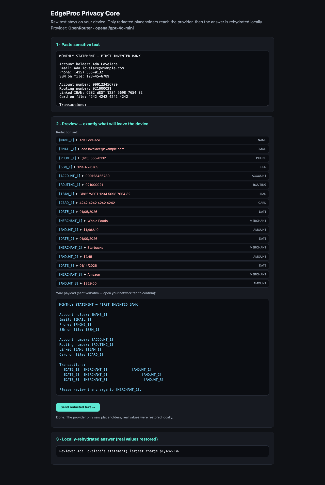

# @edgeproc/privacy-core

A browser-side privacy boundary for LLM calls. Raw private text stays on your
device; only **policy-approved, redacted** text is allowed to reach an external
LLM; the model's reply is **rehydrated locally** so you see real values again.



## TL;DR

- **What it is** — a TypeScript library that redacts sensitive text *before* it
  leaves the browser, swapping each detected value for a typed placeholder
  (`[CARD_1]`, `[NAME_2]`, `[AMOUNT_1]`), then restores the real values locally
  when the model replies. You see and approve the exact text that will be sent.
- **Why it works** — the load-bearing trick is a **type-enforced Egress Guard**:
  provider adapters accept *only* a branded `RedactedPayload`, whose sole
  constructor is the redaction pipeline. A raw `string` is not assignable, so
  **handing raw text to a provider is a compile error** — not a discipline you
  have to remember. `pnpm build` (tsc) proves it on every build.
- **Why it exists** — people paste bank statements, medical notes, and contracts
  into chatbots every day, and all of it leaves the device in the clear. This
  makes the boundary *visible and approvable* instead of invisible.
- **Status** — `0.1.0`, graduated from a proven spike. Deterministic detection
  spine + reversible **in-memory** vault + Egress Guard + redact→rehydrate loop +
  runnable demo. Unpublished (pre-registry). The encrypted vault and contextual
  NER are deliberately **deferred** — see [Roadmap](#roadmap).

## Quickstart — one command, see the proof

```bash
# Node >= 22.13 and pnpm. Then, from the repo root:
pnpm install && pnpm demo
```

Open <http://localhost:5173>. A synthetic bank statement is pre-loaded. You will
see, top to bottom:

1. **The raw text** you'd normally paste into a chatbot.
2. **The redaction set + the exact wire payload** — every real value replaced by
   a placeholder. Open your browser's network tab to confirm: only this redacted
   text would leave the device.
3. Click **Send**. With no API key it uses the offline echo provider (runs cold);
   set `VITE_OPENROUTER_API_KEY` (copy `.env.example` → `examples/demo/.env`) to
   call a real model. Either way, **only placeholders cross the wire**.
4. **The rehydrated answer** — placeholders swapped back to real values locally,
   values that never left your machine.

Prefer to see the guarantee enforced headlessly? `pnpm test:e2e` drives the loop
in real chromium, intercepts the outbound request, and asserts only placeholders
cross the wire (and regenerates `docs/wow.png`).

## Use it as a library

```ts
import {
  redactForEgress,
  rehydrate,
  Vault,
  makeProvider,
} from "@edgeproc/privacy-core";

const vault = new Vault();
const { provider } = makeProvider({ apiKey: process.env.OPENROUTER_API_KEY });

// detect + vault-write + brand — the ONLY way to produce a RedactedPayload.
const payload = await redactForEgress(rawStatement, vault);

// provider.complete accepts ONLY a RedactedPayload — raw text won't compile.
const response = await provider.complete(payload);

// restore real values locally, on-device.
const answer = rehydrate(response.redactedText, vault);
```

## The honest hard truth (read this first, it is not a footnote)

Two limits define what this can and cannot promise. Stating them up front is the
point — over-claiming privacy is worse than claiming none.

- **Detection recall *is* the product. Anything the detector misses leaks
  silently.** No redactor catches everything: regex misses oddly-formatted
  values, NER misses unusual names, novel PII types are invisible to both. So v0
  does **not** promise "we redact everything." The v0 guarantee is scoped to
  **user-confirmed redaction**: the human reviews the proposed redaction set in
  the preview and approves it before send. Misses are caught by a person, not
  promised away by the tool. The guard's job is to make the boundary *visible and
  approvable*, not to claim perfect detection.

- **Redaction is not anonymization.** Even with every literal identifier removed,
  the *structure* still leaks a behavioral fingerprint. "`$482.10` + the word
  *insurance* + *early January*" can re-identify a person even though no name,
  card, or SSN survived. Privacy-core reduces direct identifier leakage; it does
  **not** make data anonymous, and it does not defend against a determined
  re-identification attack. Generalization modes (amount bucketing, date
  coarsening) that would start to address this are explicitly **deferred**.

If those two limits are unacceptable for a use case, this is the wrong tool.

## Architecture — maps 1:1 to `src/`

```text
src/
├── index.ts            # public API barrel — the production surface, nothing else
├── types.ts            # shared domain types (EntityType, Span, AuditEntry, …)
├── egress.ts           # the moat: branded RedactedPayload + LlmProvider + unsafeBypass
├── redact.ts           # redactForEgress — the ONLY legitimate payload constructor
├── rehydrate.ts        # local restore of real values after the reply
├── vault.ts            # Vault — reversible token<->value map (in-memory, v0)
├── detect/
│   ├── detector.ts     # detect() — merges patterns + dictionaries, drops overlaps
│   ├── patterns.ts     # the deterministic ruleset (generic + finance packs)
│   └── checksums.ts    # Luhn (cards) + IBAN mod-97
├── providers/
│   ├── factory.ts      # makeProvider — picks OpenRouter or the offline echo
│   ├── nollm.ts        # NoLLMProvider — offline echo, runs with no API key
│   └── openrouter.ts   # OpenRouterProvider — OpenAI-compatible chat/completions
└── testing.ts          # SYNTHETIC_STATEMENT fixture — via the ./testing subpath,
                        #   NEVER from the main barrel
```

The flow is the portfolio's deterministic-core law: a fast, deterministic
detection **spine** (`detect`) plus a bounded, optional inference adapter (the
NER tier — deferred). The net-new product IP is the reversible loop + vault +
the type-enforced Egress Guard.

### Public API

Everything `src/index.ts` exports, and nothing more:

| Export | Kind | Role |
|---|---|---|
| `detect` | fn | deterministic PII span detection |
| `redactForEgress` | fn | detect → vault-write → brand (only payload constructor) |
| `rehydrate` | fn | restore real values locally from placeholders |
| `Vault` | class | reversible token↔value map |
| `RedactedPayload` | type | the branded egress type |
| `LlmProvider` | interface | provider contract — accepts only `RedactedPayload` |
| `NoLLMProvider` | class | offline echo provider |
| `OpenRouterProvider` | class | OpenAI-compatible provider |
| `makeProvider` | fn | env-driven provider selector |
| `unsafeBypass` | fn | the explicit, audited escape hatch |

The brand factory (`mintRedactedPayload`) and the `SYNTHETIC_STATEMENT` fixture
are intentionally **not** on the front door — a payload can be earned, not
forged, and a fixture is never shipped by accident.

## Roadmap (explicitly deferred — not shipped in 0.1.0)

Labeled so no one mistakes it for current scope:

- **Encrypted IndexedDB vault** (AES-GCM + passphrase KDF). v0 uses an
  **in-memory** vault that clears on reload — plainly stated, by design.
- **Contextual NER adapter** (names/merchants/locations regex misses) — depends
  on the not-yet-extracted `@edgeproc/browser` runtime; off by default.
- **Audit-log persistence** (the audit sink is wired today; durable storage is
  deferred).
- **More domain packs** (medical, legal, HR, identity) beyond the lifted generic
  + finance set, and **generalization / anonymization** modes.

## License

MIT. Recognizer patterns are ported from Microsoft Presidio (MIT); the
redact/rehydrate vault design follows LLM Guard's `Anonymize`/`Vault` (MIT),
reimplemented here in TypeScript.
