# Architecture

**TL;DR** — raw private text stays on-device. A deterministic detector finds PII, a
reversible vault swaps each value for a typed placeholder, and a **type-enforced
Egress Guard** makes it a *compile error* to hand raw text to an LLM provider. The
model's reply is rehydrated locally, so real values never cross the wire.

*Diagram source: [`diagrams/privacy-loop.d2`](diagrams/privacy-loop.d2) — render with
`d2 docs/diagrams/privacy-loop.d2 docs/diagrams/privacy-loop.svg`.*

## The flow, in one pass

1. **`detect()`** (`src/detect/`) scans the text with deterministic rules: Presidio-style
   regex patterns, checksum validators (Luhn for cards, mod-97 for IBANs), and
   finance/name dictionaries. Overlapping spans are dropped (earlier/longer wins).
2. **`redactForEgress()`** (`src/redact.ts`) writes each detected value into the
   **`Vault`** (`src/vault.ts`) and replaces it with a stable typed placeholder —
   `[CARD_1]`, `[NAME_2]`; the same value always gets the same token. It returns a
   **branded `PendingRedaction`** — a review *proposal*, not yet sendable.
3. **`approve()`** (`src/egress.ts`) is the explicit review step: it converts a
   pipeline-minted `PendingRedaction` into the sendable **`RedactedPayload`**. The
   audit sink is **required**, so no approval is silent — and even a zero-detection
   result must pass through here; nothing is sendable by default.
4. **The Egress Guard** (`src/egress.ts`) is the enforcement point: `LlmProvider.complete()` accepts
   only `RedactedPayload`. A raw `string` is not assignable, so leaking raw text to a
   provider fails at `tsc` time, not in code review. `assertApproved` re-checks the
   capability at runtime; the one escape hatch, `unsafeBypass`, must emit an `AuditEntry`.
5. **Providers** (`src/providers/`) put *only placeholders* on the wire.
   `makeProvider()` picks `OpenRouterProvider` (OpenAI-compatible) when an API key is
   configured, else `NoLLMProvider` — an offline echo so the whole loop runs cold.
6. **`rehydrate()`** (`src/rehydrate.ts`) walks the reply's placeholders and restores
   real values from the vault — locally, after the response arrives, bound to the
   payload's vault so a wrong-vault restore fails closed.

## Module map — 1:1 with `src/`

| Module | Role |
|---|---|
| `src/index.ts` | Public API barrel — the production surface, nothing else |
| `src/types.ts` | Shared domain types (`EntityType`, `Span`, `AuditEntry`, …) |
| `src/egress.ts` | The enforcement point: branded `RedactedPayload`, `LlmProvider`, `unsafeBypass` |
| `src/egressReceipt.ts` | Signs allow/deny decisions into receipts — opt-in, when `guardedProvider` is given a governance context (hash of the text only) |
| `src/errors.ts` | Typed fail-closed errors |
| `src/redact.ts` | `redactForEgress` — the only legitimate payload constructor |
| `src/rehydrate.ts` | Local restore of real values after the reply |
| `src/vault.ts` | `Vault` — reversible token↔value map (in-memory, v0) |
| `src/detect/detector.ts` | `detect()` — merges patterns + dictionaries, drops overlaps |
| `src/detect/patterns.ts` | The deterministic ruleset (generic + finance packs) |
| `src/detect/checksums.ts` | Luhn (cards) + IBAN mod-97 |
| `src/providers/factory.ts` | `makeProvider` — OpenRouter or the offline echo |
| `src/providers/nollm.ts` | `NoLLMProvider` — offline echo, no API key needed |
| `src/providers/openrouter.ts` | `OpenRouterProvider` — OpenAI-compatible chat/completions |
| `src/testing.ts` | `SYNTHETIC_STATEMENT` fixture — via the `./testing` subpath only |

## Design rules

- **Deterministic core, bounded inference.** The detection spine is pure
  regex/checksum/dictionary — same input, same spans, testable offline. The contextual
  NER tier that would widen recall is a deferred, off-by-default adapter (see the
  README roadmap).
- **Bounded redaction.** `redactForEgress` rejects inputs over
  `MAX_REDACTION_INPUT_BYTES` (512 KiB UTF-8) before detector or vault work, so
  a hostile paste cannot turn repeated residual checks into an unbounded client
  resource cost.
- **Bounded provider I/O.** `OpenRouterProvider` aborts requests after
  `DEFAULT_OPENROUTER_TIMEOUT_MS` (30 seconds) and streams responses through
  `DEFAULT_OPENROUTER_MAX_RESPONSE_BYTES` (1 MiB) before parsing JSON.
- **A payload is earned, not forged.** The brand factory (`mintPendingRedaction`) is not
  exported from the barrel; test fixtures live behind `@edgeproc/privacy-core/testing`.
- **The guarantee is tested at the wire.** The Playwright e2e intercepts the real
  outbound request and asserts only placeholders cross — the same proof a user gets
  from the browser's network tab.
- **v0 vault is in-memory by design.** It clears on reload; nothing sensitive is
  persisted. The encrypted IndexedDB vault is a labeled roadmap item, not an implied
  feature.
