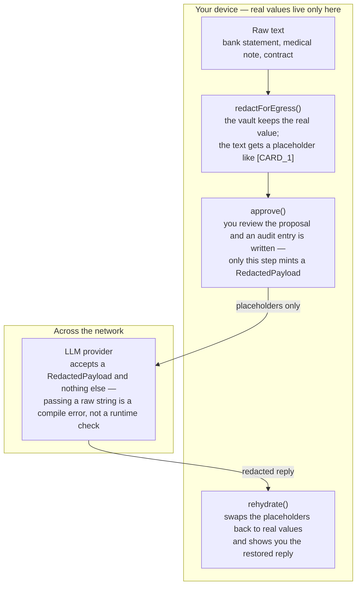

# Architecture

**TL;DR** — raw private text stays on-device. A deterministic detector finds structured
identifiers (cards, IBANs, SSNs, emails, US phones, labeled account/routing
numbers) from a fixed, published ruleset (names and free-text PII are not
generally detected). A reversible vault swaps each detected value for
a typed placeholder, and a **type-enforced Egress Guard** makes it a *compile
error* to hand raw text to an LLM provider. The model's reply is rehydrated
locally, so detected values never cross the wire. What the ruleset covers — and
what it deliberately does not — is the
[coverage table](DETECTION.md); the human review step
is what covers the rest.

## The flow, in one pass

1. **`detect()`** (`src/detect/`) scans the text with deterministic rules: Presidio-style
   regex patterns, checksum and issuance-rule validators (Luhn for cards, mod-97 for
   IBANs, SSA rules for unseparated 9-digit SSNs), and finance/name dictionaries.
   Email and phone recognizers are Unicode- and format-tolerant — see the
   [coverage table](DETECTION.md) for the exact set.
   CARD runs as two Luhn-gated rules: a print-layout grammar tried at every
   start (a card right after another digit group is still found) and v0.2.2's
   loose 13–19-digit rule, scanned the v0.2.2 way, for every other layout. IBAN
   is also tried at every start. When a validator rejects a greedy match (a
   card followed by `12/27`), the rule's shorter candidates from the same start
   are retried — word-closing prefixes for a card; for an IBAN, the
   word-closing prefixes that pass mod-97 at the country's ISO 13616 length
   (any length from 15 for a country outside the registry). Overlapping spans are MERGED into
   their union — the earlier span's type is kept and its value becomes the
   union's exact text — so an overlap can only widen what is redacted, never
   uncover a neighbour. On an exact tie, `RULES` order picks the type, which is
   why the label-gated ROUTING/ACCOUNT rules are listed before the bare-digit
   SSN rule.
2. **`redactForEgress()`** (`src/redact.ts`) writes each detected value into the
   **`Vault`** (`src/vault.ts`) and replaces it with a stable typed placeholder —
   `[CARD_1]`, `[NAME_2]`; the same value always gets the same token. It returns a
   **branded `PendingRedaction`** — a review *proposal*, not yet sendable.
3. **`approve()`** (`src/egress.ts`) is the explicit review step: it converts a
   pipeline-minted `PendingRedaction` into the sendable **`RedactedPayload`**. The
   audit sink is **required**, so no approval is silent — and even a zero-detection
   result must pass through here; nothing is sendable by default.
4. **The Egress Guard** (`src/egress.ts`) is the enforcement point: `LlmProvider.complete()` accepts
   only `RedactedPayload`. A raw `string` is not assignable, so leaking raw text to a
   provider fails at `tsc` time, not in code review. `assertApproved` re-checks the
   capability at runtime; the one escape hatch, `unsafeBypass`, must emit an `AuditEntry`.
5. **Providers** (`src/providers/`) put *only placeholders* on the wire.
   `makeProvider()` picks `OpenRouterProvider` (OpenAI-compatible) when an API key is
   configured, else `NoLLMProvider` — an offline echo so the whole loop runs cold.
6. **`rehydrate()`** (`src/rehydrate.ts`) walks the reply's placeholders and restores
   real values from the vault — locally, after the response arrives, bound to the
   payload's vault so a wrong-vault restore fails closed.

## Module map — 1:1 with `src/`

| Module | Role |
|---|---|
| `src/index.ts` | Public API barrel — the production surface, nothing else |
| `src/types.ts` | Shared domain types (`EntityType`, `Span`, `AuditEntry`, …) |
| `src/egress.ts` | The enforcement point: branded `RedactedPayload`, `LlmProvider`, `unsafeBypass` |
| `src/egressReceipt.ts` | Signs allow/deny decisions into receipts — opt-in, when `guardedProvider` is given a governance context (hash of the text only) |
| `src/errors.ts` | Typed fail-closed errors |
| `src/redact.ts` | `redactForEgress` — the only legitimate payload constructor |
| `src/rehydrate.ts` | Local restore of real values after the reply |
| `src/vault.ts` | `Vault` — reversible token↔value map (in-memory, v0) |
| `src/detect/detector.ts` | `detect()` — merges patterns + dictionaries, scans gated candidates overlapping, retries checksum-rejected matches shorter, merges overlaps into their union |
| `src/detect/patterns.ts` | The deterministic ruleset (generic + finance packs) |
| `src/detect/checksums.ts` | Luhn (cards), IBAN mod-97, SSA issuance rules (unseparated SSNs) |
| `src/providers/factory.ts` | `makeProvider` — OpenRouter or the offline echo |
| `src/providers/nollm.ts` | `NoLLMProvider` — offline echo, no API key needed |
| `src/providers/openrouter.ts` | `OpenRouterProvider` — OpenAI-compatible chat/completions |
| `src/testing.ts` | `SYNTHETIC_STATEMENT` fixture — via the `./testing` subpath only |

## Design rules

- **Deterministic core, bounded inference.** The detection spine is pure
  regex/checksum/dictionary — same input, same spans, testable offline. The contextual
  NER tier that would widen recall is a deferred, off-by-default adapter (see the
  roadmap below).
- **Bounded redaction.** `redactForEgress` rejects inputs over
  `MAX_REDACTION_INPUT_BYTES` (512 KiB UTF-8) before detector or vault work, so
  a hostile paste cannot turn repeated residual checks into an unbounded client
  resource cost.
- **Bounded provider I/O.** `OpenRouterProvider` aborts requests after
  `DEFAULT_OPENROUTER_TIMEOUT_MS` (30 seconds) and streams responses through
  `DEFAULT_OPENROUTER_MAX_RESPONSE_BYTES` (1 MiB) before parsing JSON.
- **A payload is earned, not forged.** The brand factory (`mintPendingRedaction`) is not
  exported from the barrel; test fixtures live behind `@edgeproc/privacy-core/testing`.
- **The guarantee is tested at the wire.** The Playwright e2e intercepts the real
  outbound request and asserts only placeholders cross — the same proof a user gets
  from the browser's network tab.
- **v0 vault is in-memory by design.** It clears on reload; nothing sensitive is
  persisted. The encrypted IndexedDB vault is a labeled roadmap item, not an implied
  feature.

## Security and trust model

- **Verified:** every payload a provider receives was minted by `approve()`. TypeScript checks
  that at build time (a branded type), and `assertApproved()` checks it again at run time by
  object identity in a module-private registry. Optional receipts are Ed25519-signed with your
  key via [`@edgeproc/avow`](https://www.npmjs.com/package/@edgeproc/avow) and verifiable with
  your public key.
- **Refuses rather than warns:** an unapproved or hand-built payload (`UnapprovedPayloadError`,
  before any network call); input over 512 KiB (`InputTooLargeError`, before detection); input
  that already contains label-shaped text (`PlaceholderCollisionError`); a recognized value that
  would still appear in the output (`ResidualValueError`); rehydrating with the wrong vault
  (`VaultMismatchError`); a missing API key without an explicit offline opt-in
  (`MissingApiKeyError`); an OpenRouter reply that is late, too large or malformed.
  `unsafeBypass` exists, and always writes an audit entry.
- **Not protected:** anything outside [the recognized table](DETECTION.md)
  (names, places, free text); re-identification from context; a compromised device, browser
  extension, cross-site-scripting bug or dependency, which can read the in-memory vault and a
  browser-held signing key; and whatever the AI provider does with the labeled text. Details:
  [what this does not protect you from](#what-this-does-not-protect-you-from).
- **Verify a release:** 0.3.0 is published from CI with npm provenance (an SLSA build
  attestation linking the tarball to this repository's workflow). Check it with
  `npm view @edgeproc/privacy-core@0.3.0 dist.attestations` and, in a project that installed
  it, `npm audit signatures`.

See [SECURITY.md](../SECURITY.md) for reporting a vulnerability.

## What this proves / what it does not prove

| Claim | Backed by |
| --- | --- |
| Only labels cross the network | `pnpm test:e2e` drives the browser demo in real Chromium, intercepts the outbound request, and fails if any real value is in it ([`e2e/`](../e2e/)) |
| Every format in the recognized table is redacted at the wire | [`test/detector-completeness.test.ts`](../test/detector-completeness.test.ts) |
| Nothing v0.2.2 redacted stops being redacted | [`test/v022-recall-floor.test.ts`](../test/v022-recall-floor.test.ts) (a frozen copy of the v0.2.2 recognizers) |
| A raw string cannot reach a provider | [`test/brand-compile-proof.test.ts`](../test/brand-compile-proof.test.ts) and `pnpm build` |
| Hostile input stays fast: 512 KiB of card-, IBAN- or email-shaped text in under 1.5 s (measured 100–250 ms on a CI-class Linux container, Node 22) | [`test/detection-regressions.test.ts`](../test/detection-regressions.test.ts), timed outside coverage instrumentation |
| Every source line and branch is exercised | Vitest coverage thresholds pinned at 100% in `pnpm gate` |

It does **not** prove: that anything outside the recognized table is caught (it is not); that
the redacted text is anonymous; that a compromised device, browser extension or dependency
cannot read the in-memory vault; or anything about what the AI provider does with the labeled
text it receives.

## Limitations & roadmap

### What this does not protect you from

Read this before you trust it with anything that matters. Over-claiming privacy
is worse than claiming none.

- **It only hides what it recognizes**, and that set is exactly the table above —
  patterns plus checksums plus two small dictionaries. It will miss an oddly
  formatted account number, an unusual name, a kind of private data nobody wrote
  a rule for. The built-in name list is three demo names; general name detection
  is not shipped. **That is why you review the outgoing text before it goes.** A
  human catching a miss is the actual guarantee; the tool's job is to make the
  text you're about to send visible and approvable, not to promise it caught
  everything.

- **Redaction input is bounded.** `redactForEgress` accepts at most 512 KiB of
  UTF-8 text (`MAX_REDACTION_INPUT_BYTES`). Larger input fails closed with
  `InputTooLargeError` before detection, vault writes, or audit callbacks. Split
  a large document into reviewed sections rather than raising this limit in an
  untrusted browser path.

- **Hiding names is not the same as being anonymous.** Even with every name and
  number stripped, the shape of the text can identify you: "$482.10, the word
  *insurance*, early January" can point at one person with no identifier left in
  it. This reduces direct leakage of identifiers. It does not make data
  anonymous, and it will not stop someone deliberately trying to re-identify you.

- **The vault is in memory and clears on reload.** Your real values are held in
  ordinary process/tab memory for the length of the session, by design in this
  version. An encrypted stored vault is on the roadmap, not shipped.

- **Browser key custody is same-origin, not hardware-backed.** Signing keys held
  in a browser are protected by the browser's same-origin rules and nothing
  stronger. Anything that can run code on your origin — a malicious extension, a
  cross-site scripting bug, a compromised dependency — can reach them. There is
  no secure element or OS keychain involved.

- **The OpenRouter adapter has bounded network resources.** Each request has a
  30-second end-to-end deadline and accepts at most a 1 MiB UTF-8 response by
  default. Override `timeoutMs` or `maxResponseBytes` in `OpenRouterConfig` only
  when your host has a deliberate, tested budget; timeout and overflow failures
  are typed and fail closed.

If any of those limits are unacceptable for what you're doing, this is the wrong
tool. Say so out loud rather than working around it.

### Shipped and planned

**Shipped (v0.3.0):** on-device detection of the formats in
[the recognized table](DETECTION.md); reversible labels and local restore; the
approve step; the build-time and run-time egress guard; opt-in signed receipts; the offline
stand-in and OpenRouter providers; an in-memory vault.

**Planned (not shipped):**

- An encrypted stored vault (AES-GCM + passphrase KDF over IndexedDB). Today's vault is
  in-memory and clears on reload.
- Contextual name/place detection to widen recall past the fixed ruleset, as an optional,
  off-by-default adapter.
- Durable audit and receipt storage — the sinks are wired today; persistence is not.
- More domain rule packs (medical, legal, HR, identity), and generalization modes (amount
  bucketing, date coarsening) that would start to address the anonymity limit.

## Credits

Recognizer patterns are ported from Microsoft Presidio (MIT). The redact/restore vault design follows LLM Guard's `Anonymize`/`Vault` (MIT), reimplemented here in TypeScript.
